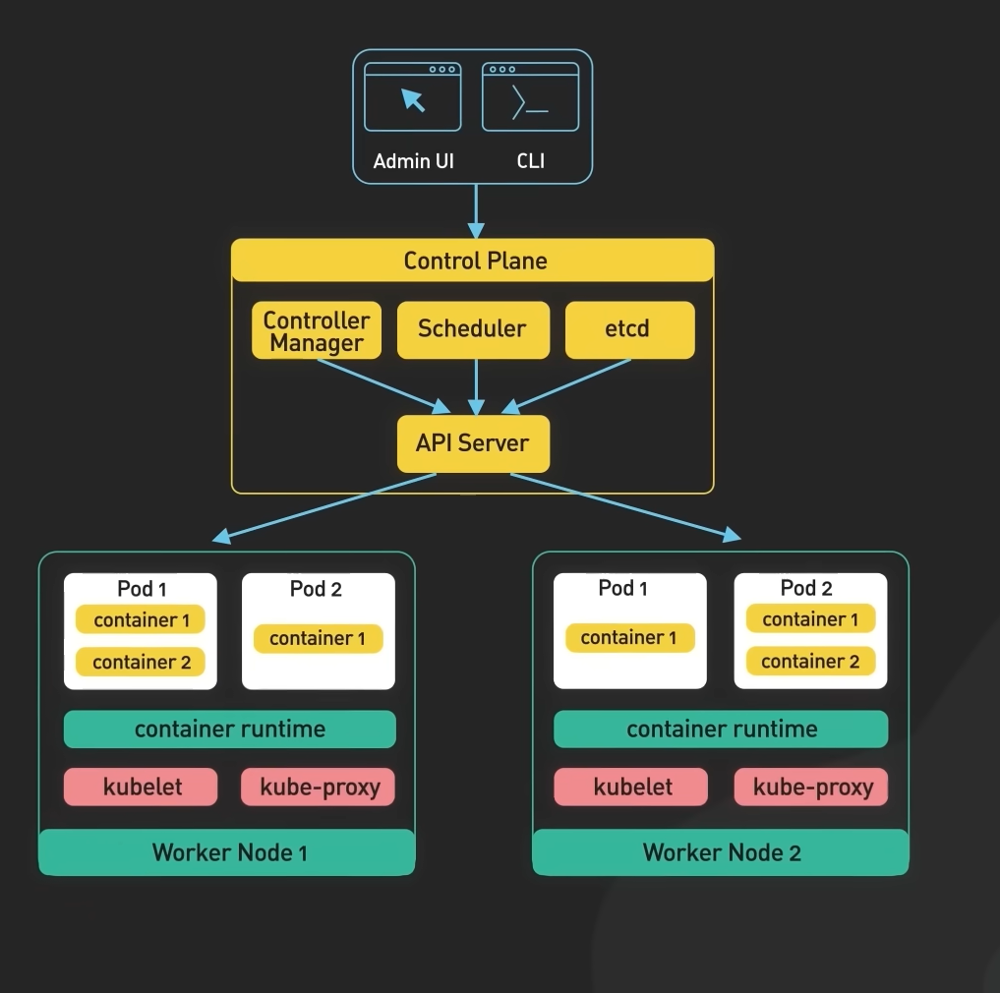

# Installation

* Step 1: Follow the link and download docker desktop https://docs.docker.com/desktop/install/windows-install/

* Step 2: Follow the instruction to install the app

* Step 3: Install the latest Windows Subsystem for Linux running:

```bash
wsl --update
```

### Enabling Hyper-V

* Press the Windows key + R to open the Run dialog box.

* Type appwiz.cpl and press Enter.

* In the Programs and Features window, select Turn Windows features on or off in the left-hand pane.

* In the Windows Features window, scroll down to Hyper-V and check the box next to it.

# Docker API


**The Docker API** is an HTTP API that allows you to interact with the Docker daemon remotely. It enables you to control and manage Docker containers, images, networks, and other resources programmatically. The API provides a set of endpoints, and you can make HTTP requests to these endpoints to perform various actions.

Here are the main components and functionalities of the Docker API:

* Docker Daemon: The Docker daemon is the background service responsible for managing Docker objects like containers, images, and volumes. It exposes an HTTP RESTful API that you can use to communicate with it.

* API Endpoints: The Docker API offers a set of RESTful endpoints, each corresponding to a specific Docker operation. For example, you can create a container, list containers, inspect images, etc. Some common endpoints include:

* /containers: Interact with containers (e.g., create, start, stop, remove).
* /images: Work with Docker images (e.g., pull, build, remove).
* /networks: Manage Docker networks.
* /volumes: Control Docker volumes.
* HTTP Requests: To interact with the Docker API, you make standard HTTP requests (GET, POST, PUT, DELETE) to the appropriate endpoints. You typically use tools or libraries capable of making HTTP requests, such as cURL, Python requests, or Node.js libraries.

* JSON Format: Data exchanged with the Docker API is usually in JSON format. This includes request bodies and responses. You need to send the necessary data in the request body when creating or modifying Docker resources.

Authentication: Depending on your Docker setup, you might need to provide authentication credentials when accessing the API to ensure security.

## Running the image

`docker run hello-world`

After running this image docker will contact the Deamon to check if we have this image on our local machine. If not it will go to registry online and get the image from there

```bash
Unable to find image 'hello-world:latest' locally
latest: Pulling from library/hello-world
719385e32844: Pull complete
Digest: sha256:926fac19d22aa2d60f1a276b66a20eb765fbeea2db5dbdaafeb456ad8ce81598
Status: Downloaded newer image for hello-world:latest

Hello from Docker!
This message shows that your installation appears to be working correctly.

To generate this message, Docker took the following steps:
 1. The Docker client contacted the Docker daemon.
 2. The Docker daemon pulled the "hello-world" image from the Docker Hub.
    (amd64)
 3. The Docker daemon created a new container from that image which runs the
    executable that produces the output you are currently reading.
 4. The Docker daemon streamed that output to the Docker client, which sent it
    to your terminal.

To try something more ambitious, you can run an Ubuntu container with:
 $ docker run -it ubuntu bash

Share images, automate workflows, and more with a free Docker ID:
 https://hub.docker.com/

```

Shows lists of running images

```bash
docker ps
docker ps -a
```

Running nginx image:

```bash
docker run -d -p 80:80 nginx # -p for port 80:80 (port 80 to match local host 80)
```
`docker stop <docker id>` - stops container

`docker start <docker id>` - starts container

`docker exec -it 61bcd388652d sh` - communicated with container via shell

# Saving changes to the docker image and pushing it to the docker hub:

To save the changes made to a Docker image and push the updated image to a Docker repository, follow these steps:

* **Make Changes to the Container:** First, you need to make the desired changes to the running Docker container. This could involve modifying files, installing software, or any other changes required for your application.

* **Commit Changes to a New Image:** Once you've made the changes to the running container, you'll create a new image from it using the docker commit command. This will create a new image with the changes incorporated.

```bash
docker commit <container_id> <new_image_name>:<tag>
```

Replace <container_id> with the ID of the running container (you can find it using docker ps) and <new_image_name>:<tag> with the desired name and tag for the new image.

* **Tag the Image for the Repository:** Now, you need to tag the new image with the appropriate name and tag that matches your Docker repository. Use the same format as before: username/repository:tag.

```bash
docker tag <new_image_name>:<tag> username/repository:tag
```

Replace <new_image_name>:<tag> with the name and tag you used in the previous step, and username/repository:tag with your Docker Hub username, repository name, and desired tag.

* **Push the Image to Docker Hub:** Push the updated image to Docker Hub using the docker push command:

```bash
docker push username/repository:tag
```

# Nginx container using Dockerfile

```docker
# select the base image of nginx

FROM nginx

# label it 

LABEL MAINTAINER=krzysztof@sparta

# copy index.html from localhost to default nginx index.html location

COPY index.html /usr/share/nginx/html/
 
# port mapping or exposing the required port

EXPOSE 80

# command to launch the web server 

CMD ["nginx", "-g", "daemon off;"]

```

# Node app container using Dockerfile

```docker
# Step 1: Choose the base image with Node.js version 12
FROM node:12

# Step 2: Set the working directory inside the container
WORKDIR /app

# Step 3: Copy the application source code from localhost to the container
COPY app /app

# Step 4: Install dependencies
RUN npm install

# Step 5: Expose the port your Node.js app is listening on
EXPOSE 3000

# Step 6: Define the startup command for your app
CMD ["npm", "start"]


```

After that:

`docker build -t majeranowski/tech241-node-app:v1 .` - . means to build from the current directory

`docker run -d -p 3000:3000 majeranowski/tech241-node-app:v1` - run the container on port 3000

# Kubernetes (K8)

Kubernetes, or k8s for short, is a system for automating application deployment. Modern applications are dispersed across clouds, virtual machines, and servers. Administering apps manually is no longer a viable option.

K8s transforms virtual and physical machines into a unified API surface. A developer can then use the Kubernetes API to deploy, scale, and manage containerized applications.

Its architecture also provides a flexible framework for distributed systems. K8s automatically orchestrates scaling and failovers for your applications and provides deployment patterns.

Why should we learn and use Kubernetes?

1. **Simplified Deployment:** Kubernetes streamlines the process of deploying applications, making it easier to move from development to production environments.

2. **Scaling Made Easy:** It allows automatic scaling of applications based on demand, so your application can handle increased traffic without manual intervention.

3. **High Availability:** Kubernetes ensures that your applications are always available, even if some parts fail. It can automatically restart or replace failed components.

4. **Resource Efficiency:** The platform optimizes the use of server resources, helping you get more done with less infrastructure.

5. **Declarative Configuration:** Kubernetes uses a declarative approach to manage applications, meaning you state what you want the application to look like, and Kubernetes takes care of the rest.

6. **Ecosystem and Community:** Kubernetes has a vibrant and large community of users, making it easier to find support and resources.

Who is using Kubernetes?

Kubernetes is widely adopted across various industries and is used by both small startups and large enterprises. Tech giants like Google, Microsoft, and Amazon use Kubernetes for their cloud services. Many other companies in finance, healthcare, e-commerce, and more have embraced Kubernetes to modernize their application infrastructure.

Benefits to businesses:

1. **Scalability:** Kubernetes allows businesses to scale their applications efficiently as their user base grows.

2. **Cost-Effectiveness:** By optimizing resource usage, Kubernetes can help businesses save on infrastructure costs.

3. **Faster Deployment:** With automated deployment and updates, businesses can roll out new features faster.

4. **High Availability:** Ensuring that applications are always available leads to improved user experience and customer satisfaction.

Kubernetes Objects:

1. **Pods:** Pods are the smallest and simplest Kubernetes objects. They represent a single instance of a running process in a cluster, typically containing one or more tightly coupled containers.

2. **Deployments:** Deployments manage the desired state of Pods. They help ensure a specified number of replicas of Pods are running at all times and can facilitate rolling updates and rollbacks.

3. **Services:** Services provide a stable endpoint for accessing a group of Pods. They enable load balancing and automatic service discovery for applications.

4. **ReplicaSets:** ReplicaSets are the previous generation of Deployments. They work similarly but lack some advanced features like rolling updates.

### Concept of Labels and Selectors:

Labels are key-value pairs attached to Kubernetes objects like Pods, Deployments, and Services. They act as metadata and help identify, categorize, and organize objects. Labels have no intrinsic semantic meaning but are useful for filtering and selecting objects.

Selectors are queries that you use to select Kubernetes objects based on their labels. They allow you to group related objects and perform actions on them collectively. For example, a Deployment might use a selector to identify which Pods it should manage and ensure the desired number of replicas are running.

### Architecture



---

**Master Node**

The Kubernetes Master (Master Node) receives input from a CLI (Command-Line Interface) or UI (User Interface) via an API. These are the commands you provide to Kubernetes.

You define pods, replica sets, and services that you want Kubernetes to maintain. For example, which container image to use, which ports to expose, and how many pod replicas to run.

**API Server**

The API Server is the front-end of the control plane and the only component in the control plane that we interact with directly. Internal system components, as well as external user components, all communicate via the same API.

**Key-Value Store (etcd)**

The Key-Value Store, also called etcd, is a database Kubernetes uses to back-up all cluster data. It stores the entire configuration and state of the cluster. The Master node queries etcd to retrieve parameters for the state of the nodes, pods, and containers.

**Controller**

The role of the Controller is to obtain the desired state from the API Server. It checks the current state of the nodes it is tasked to control, and determines if there are any differences, and resolves them, if any.

**Scheduler**

A Scheduler watches for new requests coming from the API Server and assigns them to healthy nodes. It ranks the quality of the nodes and deploys pods to the best-suited node. If there are no suitable nodes, the pods are put in a pending state until such a node appears.

---

**Worker Node**

Worker nodes listen to the API Server for new work assignments; they execute the work assignments and then report the results back to the Kubernetes Master node.

# Creating K8 deployment:

* NGINX

```yml
apiVersion: apps/v1 # which API to use for deployment
kind: Deployment # pod - service what kind of service you want to create
# what would you like to call it - name the service/object
metadata:
  name: nginx-deployment # naming the deployment
spec:
  selector:
    matchLabels:
      app: nginx #look for this label to match with k8 service
    # let's create a replica set of this with instances/pods
  replicas: 3 # 3 pods
    # template to use it's label for k8 service to launch in the browser
  template:
    metadata:
      labels:
        app: nginx # this label connects to the service or any other k8 components
  # let's define the container spec
    spec:
      containers:
      - name: nginx
        image: majeranowski/tech241-nginx:v1 # use the image that you built
        ports:
        - containerPort: 80

# create a kubernetes nginx-service.yml to create a k8 servicekube
```
* NODE

```yml
apiVersion: apps/v1 # which API to use for deployment
kind: Deployment # pod - service what kind of service you want to create
# what would you like to call it - name the service/object
metadata:
  name: node-deployment # naming the deployment
spec:
  selector:
    matchLabels:
      app: node #look for this label to match with k8 service
    # let's create a replica set of this with instances/pods
  replicas: 3 # 3 pods
    # template to use it's label for k8 service to launch in the browser
  template:
    metadata:
      labels:
        app: node # this label connects to the service or any other k8 components
  # let's define the container spec
    spec:
      containers:
      - name: node
        image: majeranowski/tech241-node-app:v1 # use the image that you built
        ports:
        - containerPort: 3000

# create a kubernetes nginx-service.yml to create a k8 servicekube
```

`kubectl create -f nginx-k8.yml` - creating a k8 deployment from the yml file we created

`kubectl get deployment` - check deployments running

`kubectl get pods` - check pods running

```bash
$ kubectl get deployment
NAME               READY   UP-TO-DATE   AVAILABLE   AGE
nginx-deployment   3/3     3            3           18s
node-deployment    3/3     3            3           3m15s

```

# Creting nginx and node service to run deployments in the browser

NGINX Service:

```yml
---
# select the type of API version and type of service
apiVersion: v1
kind: Service
#Metadata for name
metadata:
  name: nginx-svc
  namespace: default  # sre
# Specification to include ports Selector to connect to the deployment
spec:
  ports:
  - nodePort: 30001 # range is 30000 - 32768
    port: 80
    targetPort: 80

# Let's define the selector and label to connect to nginx deployment
  selector:
    app: nginx

  # Creating NodePort of deployment
  type: NodePort # alse use LoadBalancer - for local use ClasterIP
```

NODE Service:

```yml
---
# select the type of API version and type of service
apiVersion: v1
kind: Service
#Metadata for name
metadata:
  name: node-svc
  namespace: default  # sre
# Specification to include ports Selector to connect to the deployment
spec:
  ports:
  - nodePort: 30002 # range is 30000 - 32768
    port: 3000
    targetPort: 3000

# Let's define the selector and label to connect to nginx deployment
  selector:
    app: node

  # Creating NodePort of deployment
  type: NodePort # alse use LoadBalancer - for local use ClasterIP
```

After writing a yml file we need to create services:

```bash
kubectl create -f nginx-service.yml
kubectl create -f node-service.yml
```

```bash
$ kubectl get svc
NAME         TYPE        CLUSTER-IP       EXTERNAL-IP   PORT(S)          AGE
kubernetes   ClusterIP   10.96.0.1        <none>        443/TCP          2d22h
nginx-svc    NodePort    10.109.170.244   <none>        80:30001/TCP     40m
node-svc     NodePort    10.103.173.254   <none>        3000:30002/TCP   2m43s
```

# Connecting app to db

* Step 1: Create PVC for mongo

```yml
apiVersion: v1
kind: PersistentVolumeClaim
metadata:
  name: mongo-db
spec:
  accessModes:
    - ReadWriteOnce
  resources:
    requests:
      storage: 256Mi
```

`kubectl create -f mongodb-pvc.yml`

* Step 2: Create Mongo Deployment

```yml


apiVersion: apps/v1 # which API to use for deployment
kind: Deployment # pod - service what kind of service you want to create
# what would you like to call it - name the service/object
metadata:
  name: mongo # naming the deployment
spec:
  selector:
    matchLabels:
      app: mongo #look for this label to match with k8 service
    # let's create a replica set of this with instances/pods
  replicas: 1 # 3 pods
    # template to use it's label for k8 service to launch in the browser
  template:
    metadata:
      labels:
        app: mongo # this label connects to the service or any other k8 components
  # let's define the container spec
    spec:
      containers:
        - name: mongo
          image: majeranowski/tech241-mongodb:v1 # use the image that you built
          ports:
            - containerPort: 27017
          volumeMounts:
            - name: storage
              mountPath: /data/db
      volumes:
        - name: storage
          persistentVolumeClaim:
            claimName: mongo-db

```

* Step 3: Create mongo service

```yml
apiVersion: v1
kind: Service
metadata:
  name: mongo
spec:
  selector:
    app: mongo
  ports:
    - port: 27017
      targetPort: 27017
```

* Step 4: Create node deployment

```yml
apiVersion: apps/v1 # which API to use for deployment
kind: Deployment # pod - service what kind of service you want to create
# what would you like to call it - name the service/object
metadata:
  name: node # naming the deployment
spec:
  selector:
    matchLabels:
      app: node #look for this label to match with k8 service
    # let's create a replica set of this with instances/pods
  replicas: 3 # 3 pods
    # template to use it's label for k8 service to launch in the browser
  template:
    metadata:
      labels:
        app: node # this label connects to the service or any other k8 components
  # let's define the container spec
    spec:
      containers:
        - name: node
          image: majeranowski/tech241-node-app:v1 # use the image that you built
          ports:
            - containerPort: 3000
          env:
            - name: DB_HOST
              value: mongodb://mongo:27017/posts
          imagePullPolicy: Always
# create a kubernetes nginx-service.yml to create a k8 servicekube
```

* Step 5: Create node service

```yml
---
# select the type of API version and type of service
apiVersion: v1
kind: Service
#Metadata for name
metadata:
  name: node-svc
  namespace: default  # sre
# Specification to include ports Selector to connect to the deployment
spec:
  ports:
  - nodePort: 30002 # range is 30000 - 32768
    port: 3000
    targetPort: 3000

# Let's define the selector and label to connect to nginx deployment
  selector:
    app: node

  # Creating NodePort of deployment
  type: NodePort # alse use LoadBalancer - for local use ClasterIP
```

* Step 7:

Create mongo and node deployment, service

`kubectl create -f ...`

### To seed database

```bash
kubectl exec pod-name  env node seeds/seed.js
```


