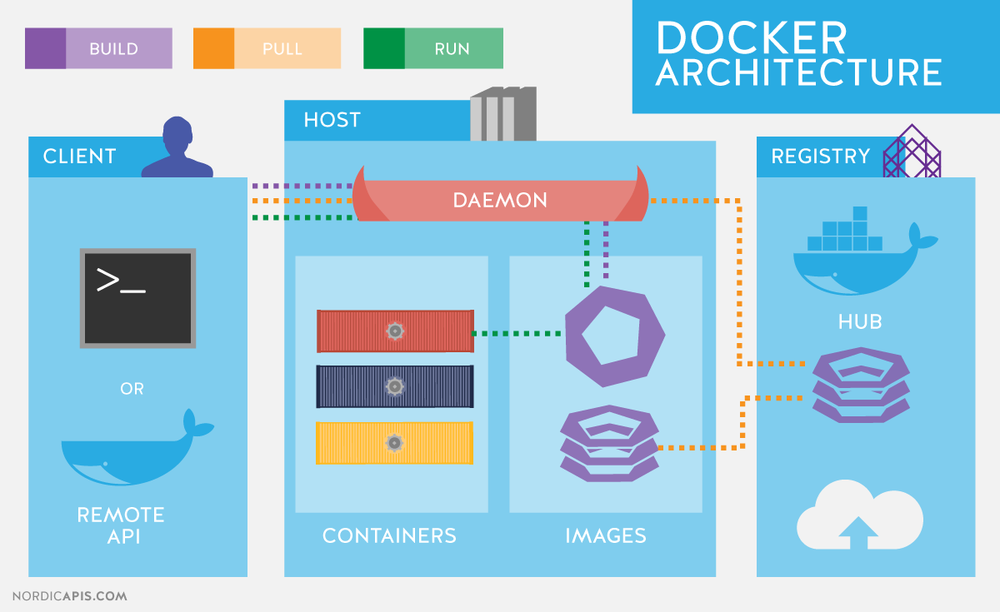

# Installation

* Step 1: Follow the link and download docker desktop https://docs.docker.com/desktop/install/windows-install/

* Step 2: Follow the instruction to install the app

* Step 3: Install the latest Windows Subsystem for Linux running:

```bash
wsl --update
```

### Enabling Hyper-V

* Press the Windows key + R to open the Run dialog box.

* Type appwiz.cpl and press Enter.

* In the Programs and Features window, select Turn Windows features on or off in the left-hand pane.

* In the Windows Features window, scroll down to Hyper-V and check the box next to it.

# Docker API



**The Docker API** is an HTTP API that allows you to interact with the Docker daemon remotely. It enables you to control and manage Docker containers, images, networks, and other resources programmatically. The API provides a set of endpoints, and you can make HTTP requests to these endpoints to perform various actions.

Here are the main components and functionalities of the Docker API:

* Docker Daemon: The Docker daemon is the background service responsible for managing Docker objects like containers, images, and volumes. It exposes an HTTP RESTful API that you can use to communicate with it.

* API Endpoints: The Docker API offers a set of RESTful endpoints, each corresponding to a specific Docker operation. For example, you can create a container, list containers, inspect images, etc. Some common endpoints include:

* /containers: Interact with containers (e.g., create, start, stop, remove).
* /images: Work with Docker images (e.g., pull, build, remove).
* /networks: Manage Docker networks.
* /volumes: Control Docker volumes.
* HTTP Requests: To interact with the Docker API, you make standard HTTP requests (GET, POST, PUT, DELETE) to the appropriate endpoints. You typically use tools or libraries capable of making HTTP requests, such as cURL, Python requests, or Node.js libraries.

* JSON Format: Data exchanged with the Docker API is usually in JSON format. This includes request bodies and responses. You need to send the necessary data in the request body when creating or modifying Docker resources.

Authentication: Depending on your Docker setup, you might need to provide authentication credentials when accessing the API to ensure security.

## Running the image

`docker run hello-world`

After running this image docker will contact the Deamon to check if we have this image on our local machine. If not it will go to registry online and get the image from there

```bash
Unable to find image 'hello-world:latest' locally
latest: Pulling from library/hello-world
719385e32844: Pull complete
Digest: sha256:926fac19d22aa2d60f1a276b66a20eb765fbeea2db5dbdaafeb456ad8ce81598
Status: Downloaded newer image for hello-world:latest

Hello from Docker!
This message shows that your installation appears to be working correctly.

To generate this message, Docker took the following steps:
 1. The Docker client contacted the Docker daemon.
 2. The Docker daemon pulled the "hello-world" image from the Docker Hub.
    (amd64)
 3. The Docker daemon created a new container from that image which runs the
    executable that produces the output you are currently reading.
 4. The Docker daemon streamed that output to the Docker client, which sent it
    to your terminal.

To try something more ambitious, you can run an Ubuntu container with:
 $ docker run -it ubuntu bash

Share images, automate workflows, and more with a free Docker ID:
 https://hub.docker.com/

```

Shows lists of running images

```bash
docker ps
docker ps -a
```

Running nginx image:

```bash
docker run -d -p 80:80 nginx # -p for port 80:80 (port 80 to match local host 80)
```
`docker stop <docker id>` - stops container

`docker start <docker id>` - starts container

`docker exec -it 61bcd388652d sh` - communicated with container via shell

# Saving changes to the docker image and pushing it to the docker hub:

To save the changes made to a Docker image and push the updated image to a Docker repository, follow these steps:

* **Make Changes to the Container:** First, you need to make the desired changes to the running Docker container. This could involve modifying files, installing software, or any other changes required for your application.

* **Commit Changes to a New Image:** Once you've made the changes to the running container, you'll create a new image from it using the docker commit command. This will create a new image with the changes incorporated.

```bash
docker commit <container_id> <new_image_name>:<tag>
```

Replace <container_id> with the ID of the running container (you can find it using docker ps) and <new_image_name>:<tag> with the desired name and tag for the new image.

* **Tag the Image for the Repository:** Now, you need to tag the new image with the appropriate name and tag that matches your Docker repository. Use the same format as before: username/repository:tag.

```bash
docker tag <new_image_name>:<tag> username/repository:tag
```

Replace <new_image_name>:<tag> with the name and tag you used in the previous step, and username/repository:tag with your Docker Hub username, repository name, and desired tag.

* **Push the Image to Docker Hub:** Push the updated image to Docker Hub using the docker push command:

```bash
docker push username/repository:tag
```

# Nginx container using Dockerfile

```docker
# select the base image of nginx

FROM nginx

# label it 

LABEL MAINTAINER=krzysztof@sparta

# copy index.html from localhost to default nginx index.html location

COPY index.html /usr/share/nginx/html/
 
# port mapping or exposing the required port

EXPOSE 80

# command to launch the web server 

CMD ["nginx", "-g", "daemon off;"]

```

# Node app container using Dockerfile

```docker
# Step 1: Choose the base image with Node.js version 12
FROM node:12

# Step 2: Set the working directory inside the container
WORKDIR /app

# Step 3: Copy the application source code from localhost to the container
COPY app /app

# Step 4: Install dependencies
RUN npm install

# Step 5: Expose the port your Node.js app is listening on
EXPOSE 3000

# Step 6: Define the startup command for your app
CMD ["npm", "start"]


```

After that:

`docker build -t majeranowski/tech241-node-app:v1 .` - . means to build from the current directory

`docker run -d -p 3000:3000 majeranowski/tech241-node-app:v1` - run the container on port 3000